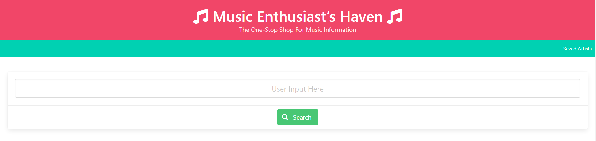
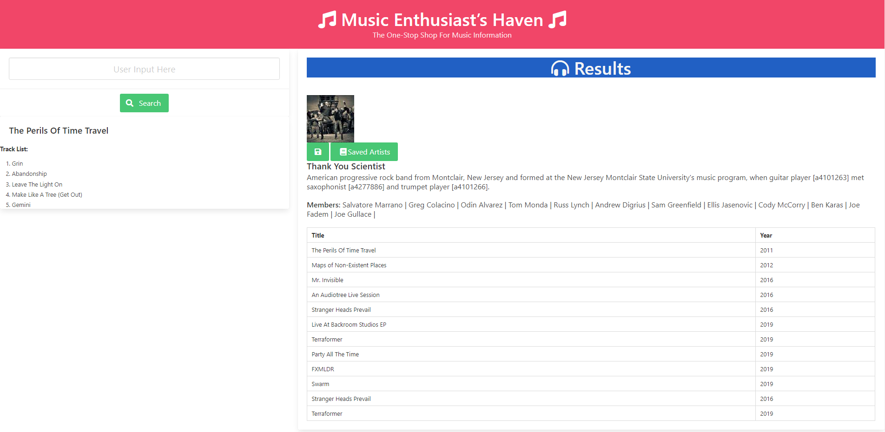
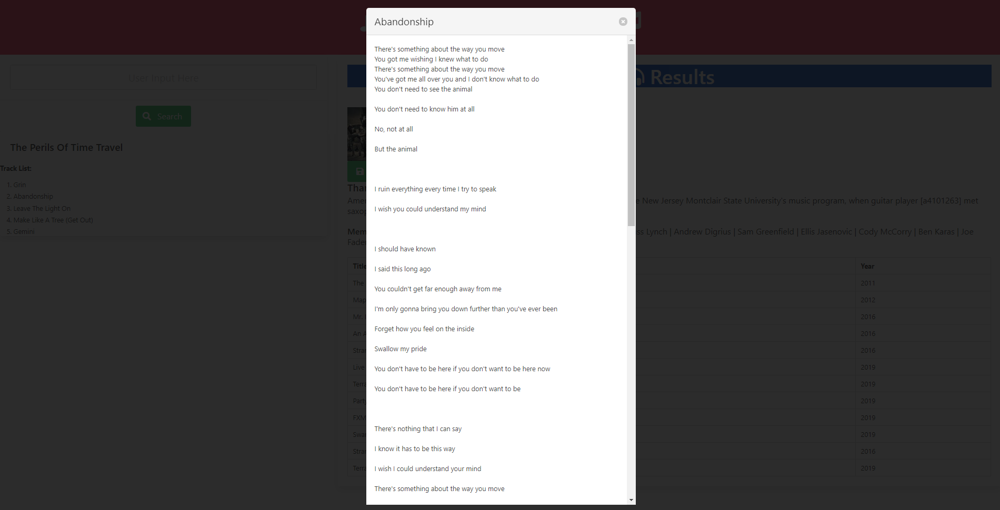

# music-project

### Description
The goal of the website is to make a one stop shop for music. We wanted to be able to look up artist and see the artist's profile and discography. Given their different discographies, we want to see the tracks of each album. We added a save button so that we can have a place to see our favorite artist.

### User Story
```
As a music enthusiast,
I WANT to look up certain artist,
SO THAT I can see their discography
I WANT to see lyrics of certain songs,
SO THAT I can learn the song
```

[wireframe](https://docs.google.com/presentation/d/1eNv91CRo9jigU1O6T9M-yQG6Fqs2icz03ubA5fwtjrk/edit?usp=sharing)

### Functionality


As shown above,
* Input field to search an artist
* Search button to search for inputted artist
* Nav bar with saved artist from local storage



As shown above,
* Input field and search button on the left to search a different artist on the same page
* Results of searched artist on the right side
    * Picture of artist
    * Artist/Band name
    * If it is a group, members of the group is given
    * Discography of the artist and the year it was made
    * Save button to save the artist and saved artist button to see previously saved artist
* Track list of the selected album is shown on the left when one clicks an album title
    * Clicking on the track would pop a modal for the lyrics

Example of Lyrics Shown:


[Link to Website!](https://thebadams.github.io/music-project)

### Contributions
[Brian Adams](https://github.com/thebadams)

[Jasper Abarquez](https://github.com/KuyaJasper)

[Cameron Rushing](https://github.com/CMRushing)

[Nestor Campaner](https://github.com/itsnestor)